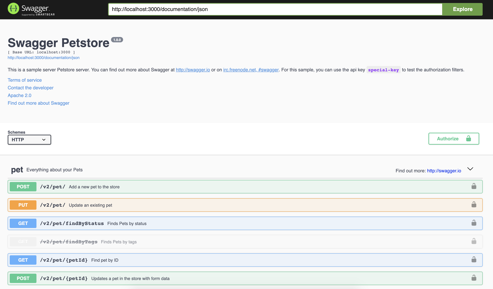

# create-fastify-app

[](http://standardjs.com/) [](https://coveralls.io/github/davidedantonio/create-fastify-app?branch=master) [](https://travis-ci.com/davidedantonio/create-fastify-app) [](https://greenkeeper.io/) 

Create Fastify App is an utility that help you to generate or add plugin to your [Fastify](https://github.com/fastify/fastify) project. This mean that you can easily:

- Generate a Fastify Project, also from a given swagger file.
- Generate a service skeleton in existing Fastify Project.
- Add fastify-cors plugin in existing Fastify Project.
- Add fastify-mongodb plugin in existing Fastify Project.
- Add fastify-redis plugin in existing Fastify Project.
- Add fastify-postgres plugin in existing Fastify Project.

## Install

If you want to use `fastify-app` you must first install globally on your machine

```
npm install -g create-fastify-app
```

## Usage

```
Generate Fastify projects and utilities:

  fastify-app [command] <options>

Command
  generate:project     Generate a ready to use Fastify project
  generate:service     Generate service skeleton source in given project
  add:mysql            Add fastify-mysql plugin in given project folder
  add:mongo            Add fastify-mongodb plugin in given project folder
  add:cors             Add fastify-cors plugin in given project folder
  add:redis            Add fastify-redis plugin in given project folder
  add:postgres         Add fastify-postgres plugin in given project folder
  add:pov              Add Point-Of-View plugin in given project folder

Options

  -d, --directory
      Fastify project folder

  -h, --help
      Show this help message
```

Except for `generate:project` command the others work on an existent project created with `fastify-app`.

### `generate:project`

Generate a new Fastify project run following command

```
fastify-app generate:project -d <project-folder>
```

If `-d`, or `--directory`, option is omitted the new project will be created in curret folder. At this point further information will be asked:

- **Application Name**: the application name.
- **Description**: a short description non how the application do.
- **Author**: the application author.
- **Email**: the application email author.
- **Version**: semver version.
- **Keywords**: a list of comma separated keywords.
- **License**: the application license.
- **Swagger File**: a swagger file to start from (YAML or JSON).

After providing these information the entire application skeleton will be created for you. Simply run

```
cd /your/wonderful/application
npm install
npm run dev
```

#### Project structure

By default `fastify-app` generate a project structured in this way:

```
/your/wonderful/application
├── docker-compose.yml
├── Dockerfile
├── help
│   └── start.txt
├── package.json
├── README.md
├── src
│   ├── hooks
│   │   ├── onError.js
│   │   ├── onRequest.js
│   │   ├── onResponse.js
│   │   ├── onSend.js
│   │   ├── preHandler.js
│   │   ├── preParsing.js
│   │   ├── preSerialization.js
│   │   └── preValidation.js
│   ├── index.js
│   ├── plugins
│   │   ├── README.md
│   │   └── support.js
│   └── services
│       ├── hello
│       │   └── index.js
│       ├── README.md
│       └── root.js
└── test
    ├── helper.js
    ├── plugins
    │   └── support.test.js
    └── services
        ├── example.test.js
        └── root.test.js
```

The `src` folder contains all you need to develop your application. In particular, she contains the following directories:

- `plugins`: here you can add all your plugins you need into you application.
- `services`: here you can develop all the endpoint you need for your application, or the generated endpoint if you give a swagger file at project creation.
- `hooks`: here you can declare all the hooks you need for your fastify application.

The `package.json` file comes with three predefined npm task:

```diff
"scripts": {
  "test": "tap test/**/*.test.js",
  "start": "fastify-app run",
  "dev": "fastify-app run -l info -P -w"
}
```

* `npm test`: runs the test
* `npm start`: start your application
* `npm run dev`: start your application with [`pino-colada`](https://github.com/lrlna/pino-colada) pretty logging and in watching mode

The `Dockerfile` and the `docker-compose.yml` files allow you to dockerize your application. When you add a plugin, for example with `add:mongo`, the `docker-compose.yml` will automatically updated with given information. Here the `Dockerfile` generated:

```
FROM node:latest
RUN mkdir -p /usr/src/app
WORKDIR /usr/src/app
COPY package.json /usr/src/app/
RUN npm install
COPY . /usr/src/app
EXPOSE 3000
CMD [ "npm", "install", "-g", "create-fastify-app" ]
CMD [ “npm”, "start" ]
```

and the `docker-compose.yml`:

```
version: '3.7'
services:
  fastify-app:
    container_name: fastify-app
    restart: always
    build: .
    image: fastify-app:1.0.0
    ports:
      - '3000:3000'
    expose:
      - '3000'
```

#### Options

You can pass the following options via command line with `fastify run <options>`. Every options has the corresponding environment variable:

|  Description | Short command | Full command | Environment variable |
| ------------- | ------------- |-------------| ----- |
| The application file to start | `-f` | `--file` | `FASTIFY_FILE` |
| Port to listen on (default to 3000) | `-p` | `--port` | `FASTIFY_PORT or PORT` |
| Address to listen on | `-a` | `--address` | `FASTIFY_ADDRESS` |
| Log level (default to fatal) | `-l` | `--log-level` | `FASTIFY_LOG_LEVEL` |
| Prints pretty logs | `-P` | `--pretty-logs` | `FASTIFY_PRETTY_LOGS` |
| Use custom options | `-o` | `--options` | `FASTIFY_OPTIONS` |
| Set the prefix | `-r` | `--prefix` | `FASTIFY_PREFIX` |
| Set the plugin timeout | `-T` | `--plugin-timeout` | `FASTIFY_PLUGIN_TIMEOUT` |
| Defines the maximum payload, in bytes,<br>the server is allowed to accept |  | `--body-limit` | `FASTIFY_BODY_LIMIT` |
| Start the application in watching mode on your file changes | `-w` | `--watch` | |

#### Generate a project from a swagger file

When you generate a new project you can give in input a swagger file. In an api driven project this feature can be very important because `fastify-app` will generate all your project endpoints for you. You will only have to worry about the development of the various endpoints.

If you give in input the [Petstore](https://editor.swagger.io/?_ga=2.5251579.932457202.1552732701-831465500.1549699944) swagger file given as example on [Swagger.io](https://swagger.io), you can see that `fastify-app` automatically generate a project with `fastify-swagger` already configured and ready to use in your project. If you take a look at `/documentation` endpoint you'll find something like that:



In your `src/services` folder you'll find your endpoints folder

```
./src/services
├── README.md
├── pet
│   ├── index.js
│   └── routes.schema.js
├── root.js
├── store
│   ├── index.js
│   └── routes.schema.js
└── user
    ├── index.js
    └── routes.schema.js
```

### `generate:service`

This command allow you to generate a new service skeleton for your api. You simply run

```
fastify-app generate:service -d <project-folder>
```

And give some information such as:

- **Service Name**: The name of the service you want to generate
- **Methods to implement**: GET, POST, PUT, DELETE etc.
- **Api Prefix**: The prefix url (for example `/api`)

Moreover the command generate for you a small set of test foreach methods.

### `add:mongo`

If you want to easily add the [`fastify-mongodb`](https://github.com/fastify/fastify-mongodb) plugin to your application this command is all you need. Just simply run

```
fastify-app add:mongo -d <project-folder>
```

And give some information such as:

- **MongoDB Host**: your MongoDB host.
- **MongoDB Port**: your MongoDB port.
- **MongoDB Collection**: your default collection.
- **MongoDB User**: your MongoDB user.
- **MongoDB Password**: your MongoDB password.

At this point the command add the `fastify-mongodb` to you application with the given information for your [MongoDB](https://www.mongodb.com) connection.

### `add:mysql`

If you want to easily add the [`fastify-mysql`](https://github.com/fastify/fastify-mysql) plugin to your application this command is all you need. Just simply run

```
fastify-app add:mysql -d <project-folder>
```

And give some information such as:

- **MySQL Host**: your MySQL host.
- **MySQL Port**: your MySQL port.
- **MySQL Database**: your default database.
- **MySQL User**: your MySQL user.
- **Mysql Password**: your MySQL password.

At this point the command add the `fastify-mysql` to you application with the given information for your [MySQL](https://www.mysql.com) connection.

### `add:redis`

If you want to easily add the [`fastify-redis`](https://github.com/fastify/fastify-redis) plugin just simply run

```
fastify-app add:redis -d <project-folder>
```

And give some information such as:

- **Redis Host**: your redis host
- **Redis Port**: your redis port
- **Redis Password**: your redis password, if you have one.
- **Redis Index**: your redis index

exactly as the `add:mongo` and `add:mysql` command `add:redis` add the plugin into your application plugins folder with the given information for your [Redis](https://redis.io) connection.

### `add:cors`

If you want to easily add the [`fastify-cors`](https://github.com/fastify/fastify-cors) plugin just simply run

```
fastify-app add:cors -d <project-folder>
```

And give some information such as:

- **Method**: at least one of DELETE, PATCH, POST, PUT, HEAD, OPTIONS

after the choises `fastify-cors` plugin will be added in your application.

### `add:postgres`

If you want to easily add the [`fastify-postgres`](https://github.com/fastify/fastify-postgres) plugin to your application this command is all you need. Just simply run

```
fastify-app add:postgres -d <project-folder>
```

And give some information such as:

- **Postgres Host**: your Postgres host.
- **Postgres Port**: your Postgres port.
- **Postgres Database**: your default database.
- **Postgres User**: your Postgres user.
- **Postgres Password**: your Postgres password.

At this point the command add the `fastify-postgres` to you application with the given information for your [Postgres](https://www.postgresql.org/) connection.

### `add:pov`

This option add [`point-of-view`](https://github.com/fastify/point-of-view) plugin to you fastify project. `point-of-view` decorates the reply interface with the view method for manage view engines that can be used to render templates responses. You can decide to install one of the following template engines:

- ejs
- ejs-mate
- nunjucks
- pug
- handlebars
- marko
- mustache
- art-template

Just simply run

```
fastify-app add:pov -d <project-folder>
```

## Eject your application

**Note: this is a one-way operation. Once you eject, you can’t go back!**

If you aren’t satisfied with the build tool and configuration choices, you can eject at any time. This command will remove the `fastify-app` dependency from your code.

To do this you can run

```
fastify-app eject
```

from your application root. This command will copy all the files that `fastify-app` use to run your application (the watch module for example). All the command, except the `eject` obviously, will still work, but they will point to the copied script in your root folder, and yes you can hack them.

So when you eject your application your project structure is something like this:

```
├── args
│   └── run.js
├── docker-compose.yml
├── Dockerfile
├── help
│   └── start.txt
├── lib
│   └── watch
│       ├── constants.js
│       ├── fork.js
│       ├── index.js
│       └── utils.js
├── package.json
├── README.md
├── run.js
├── src
│   ├── hooks
│   │   ├── onError.js
│   │   ├── onRequest.js
│   │   ├── onResponse.js
│   │   ├── onSend.js
│   │   ├── preHandler.js
│   │   ├── preParsing.js
│   │   ├── preSerialization.js
│   │   └── preValidation.js
│   ├── index.js
│   ├── plugins
│   │   ├── README.md
│   │   └── support.js
│   └── services
│       ├── hello
│       │   └── index.js
│       ├── README.md
│       └── root.js
└── test
    ├── helper.js
    ├── plugins
    │   └── support.test.js
    └── services
        ├── example.test.js
        └── root.test.js
```

Your script package json now have many more dependencies, and the `start` and `dev` scripts looks like the following lines:

```
"scripts": {
  "test": "tap test/**/*.test.js",
  "start": "node run.js",
  "dev": "node run.js -l info -P -w"
}
```

## Contributing

If you feel you can help in any way, be it with examples, extra testing, or new features please open a pull request or open an issue.

The code follows the Standard code style.

[](https://github.com/feross/standard)

### Running Tests

The version `2.0` comes with a `docker-compose.yml` with all the necessary to run tests. Simply install [docker](https://docs.docker.com/install/) and [docker-compose](https://docs.docker.com/compose/install/) and run `docker-compose up -d`. After do that simply run `npm run test`.

## Acknowledgements

It is inspired by the [fastify-cli](https://github.com/fastify/fastify-cli) project. Some part have been extracted from it.

This project is kindly sponsored by [Webeetle s.r.l.](https://www.webeetle.com)

## License

Licensed under [MIT](./LICENSE).
